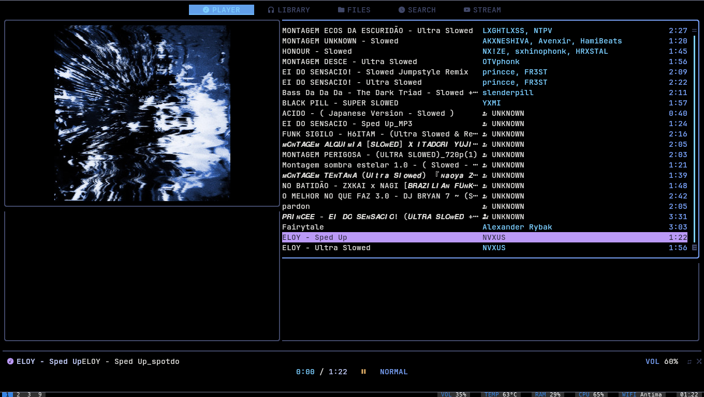
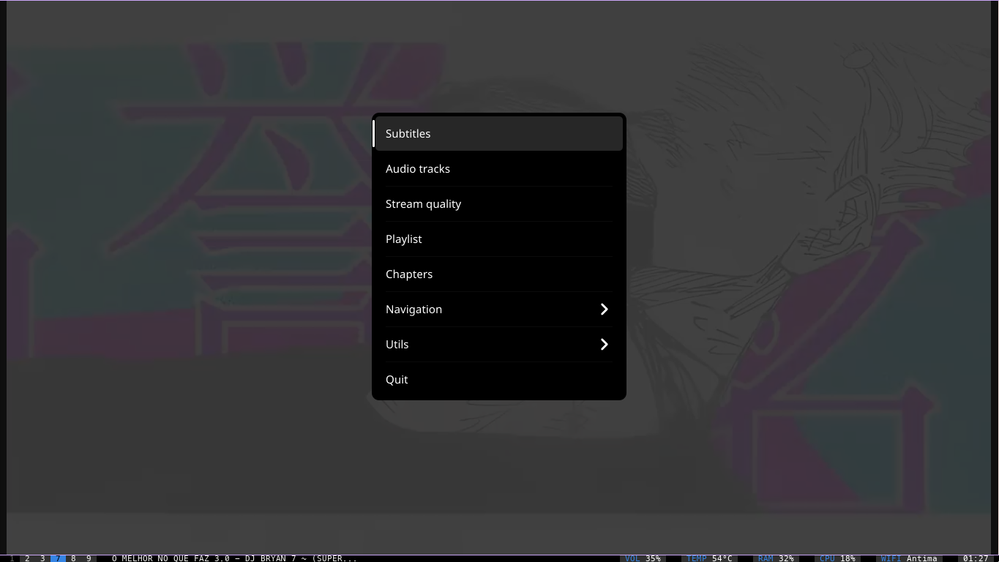
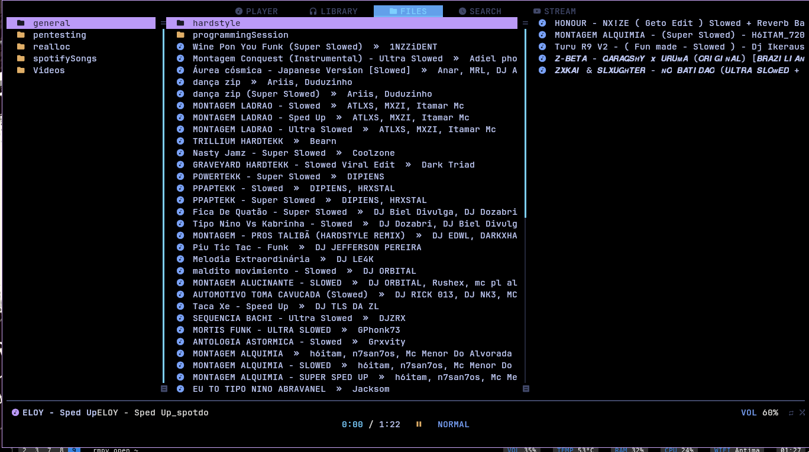

# rmpv 🎵📺

A lightweight terminal-based music + video controller using **mpv + yt-dlp + mpc + rmpc**
Built for fast media playback, YouTube streaming, and CLI control.

---

## ⚡ Preview

### 🎬 CLI Workflow


---

### 🖥️ TUI (rmpc Interface)


---

### 📸 UI Screenshots





---

## 🚀 Features

* 🎧 Play local music instantly
* 📺 Stream YouTube videos via mpv
* 🔍 Search and play directly from CLI
* 🎛️ Full playback control via rmpc
* 💾 Automatic config setup
* ⚡ Minimal + fast

---

## 📦 Dependencies

### Core

* `mpv` → media player
* `yt-dlp` → YouTube/media extractor
* `mpc` → MPD client
* `rmpc` → TUI controller

---

### Install (Arch Linux)

```bash
sudo pacman -S mpv yt-dlp mpc mpd
```

### Install rmpc

```bash
cargo install rmpc
```

---

## 🛠️ Installation

```bash
git clone https://github.com/Trifalic47/rmpv.git
cd rmpv
bash install.sh
```

---

## 🎮 Usage

```bash
rmpv open
rmpv play <url/file>
rmpv search "song name"
```

---

## ⌨️ Keybindings

### 🎵 Playback

* `p` → Play/Pause
* `s` → Stop
* `>` / `<` → Next / Previous
* `f` / `b` → Seek

---

### 🔊 Volume

* `.` → Volume up
* `,` → Volume down

---

### 🔁 Modes

* `z` → Repeat
* `x` → Shuffle
* `c` → Consume
* `v` → Single

---

### 🧭 Navigation

* `Tab` → Next tab
* `Shift + Tab` → Previous tab

---

### 🧠 App

* `q` → Quit
* `?` → Help
* `:` → Command mode

---

### 📺 YouTube

* `S` → Search YouTube
* `V` → Open video for current song

---

### 💾 MPV

* `Shift + S` → Download current media

Saved to:

```
~/Music/rmpc
```

---

## ⚙️ Config

```
~/.config/rmpv/config
```

Example:

```
MUSIC_DIR=~/Music
MPD_SOCKET=~/.config/mpd/socket
```

---

## 🧪 Troubleshooting

### Slow YouTube loading

```bash
yt-dlp --version
```

### rmpc not working

```bash
mpd --no-daemon
```

---

## 📁 Project Structure

```
rmpv/
├── bin/
├── dots/
├── images/
├── scripts/
├── install.sh
└── README.md
```

---

## 👨‍💻 Author

GitHub: https://github.com/Trifalic47
